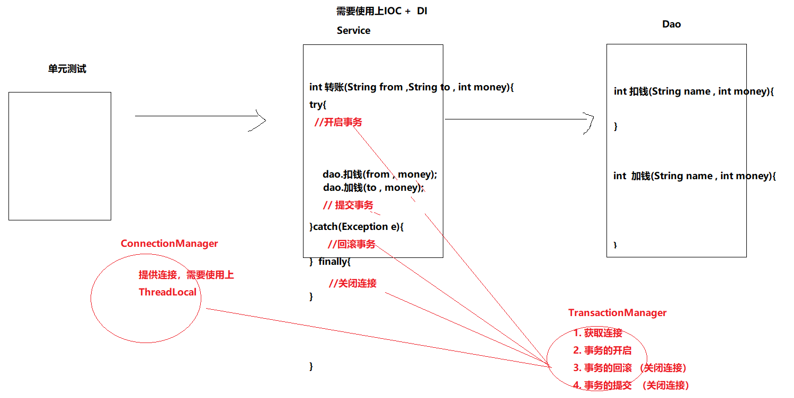
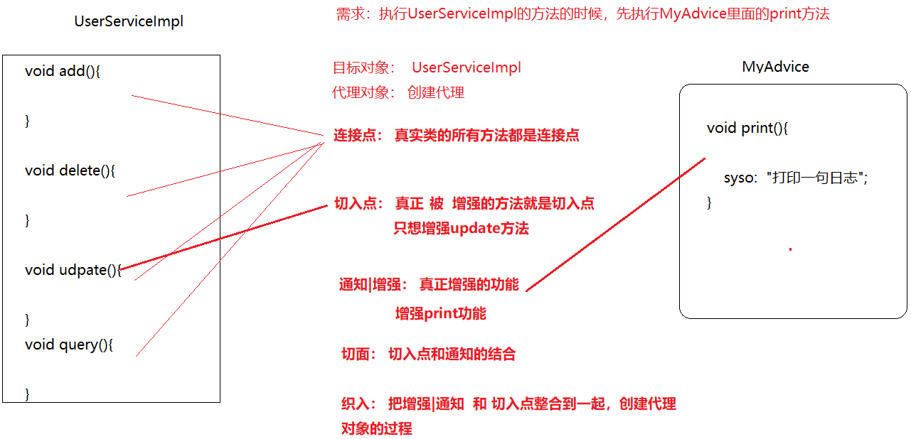
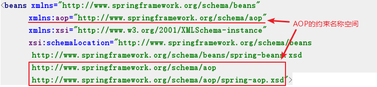
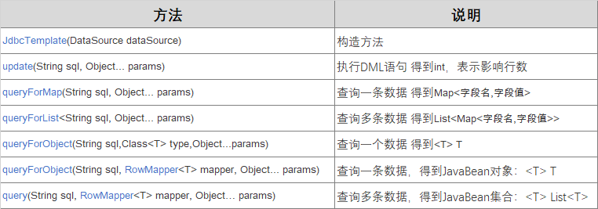

# Spring第3天 

## 学习目标

- [ ] 能够理解AOP概念
- [ ] 能够掌握基于XML的AOP配置
- [ ] 能够掌握基于注解的AOP配置
- [ ] 能够使用Spring的jdbc模板  
- [ ] 能够配置spring连接池
- [ ] 能够应用声明式事务

## 一、银行转账功能实现【理解】

### 转账功能实现

#### 需求描述

* zs给ls转账100，使用事务保证转账业务的功能正常
* 本功能的目的，是为了说明AOP的作用和原理

#### 功能分析

##### 实现流程



##### 实现步骤

1. 准备工作：

   创建Maven项目，导入依赖

2. 准备事务管理的工具类

3. 准备dao、Service层代码

   1. 在测试类中，调用Service的转账方法`transfer(付款人,收款人，转账金额)`
   2. 在Service中：

   ```
   public void transfer(付款人， 收款人 , 金额){
   	try{
           开启事务
   
           dao.扣钱(付款人 , 金额);
   
           dao.加钱(收款人 , 金额);
           提交事务
       }catch(Exception e){
           有异常就回滚事务
       }
   }
   
   ```

   3. 在dao中：执行SQL语句所使用的连接对象`Connection`，必须是Service中开启事务的连接

   ```
   public void kouqian(付款人 , 金额){
   	runner(连接对象 , sql , ...);
   }
   
   public void jiaqian(付款人 , 金额){
   	runner(连接对象 , sql , ...);
   }
   ```

4. 提供Spring的配置文件

5. 功能测试

#### 需求实现

##### 1. 准备工作

创建Maven项目，导入依赖

```xml
<dependencies>
    <!--MySql驱动-->
    <dependency>
        <groupId>mysql</groupId>
        <artifactId>mysql-connector-java</artifactId>
        <version>5.1.47</version>
    </dependency>
    <!--c3p0-->
    <dependency>
        <groupId>com.mchange</groupId>
        <artifactId>c3p0</artifactId>
        <version>0.9.5.4</version>
    </dependency>
    <!--dbutils-->
    <dependency>
        <groupId>commons-dbutils</groupId>
        <artifactId>commons-dbutils</artifactId>
        <version>1.7</version>
    </dependency>
    <!--spring-->
    <dependency>
        <groupId>org.springframework</groupId>
        <artifactId>spring-context</artifactId>
        <version>5.1.2.RELEASE</version>
    </dependency>
    <!--spring-test-->
    <dependency>
        <groupId>org.springframework</groupId>
        <artifactId>spring-test</artifactId>
        <version>5.1.2.RELEASE</version>
    </dependency>
    <!--junit-->
    <dependency>
        <groupId>junit</groupId>
        <artifactId>junit</artifactId>
        <version>4.12</version>
    </dependency>
</dependencies>
```

##### 2. 准备事务管理的工具类

* `TransactionManager`：事务管理的工具类，提供了开启事务、提交事务、回滚事务等方法
  * 注意：需要给这个工具类注入连接池对象dataSource，不要忘记提供一个连接池对象
  * 分析：
    * 1. 这个事务管理的工具类，它需要提供的功能有：  获取连接，开启事务，提交事务，回滚事务
      2. 以上的这些操作都跟连接对象有关，连接一般是从连接池里面拿的。
      3. 连接池对象(DataSource) 现在不归咱们管理，由Spring管理
      4. 在这个事务管理的工具类里面，需要让Spring注入进来连接池对象（DataSource）
      5. 这个事务管理的工具类还要具备以前的ConnectionManager的功能，所以还需要配合上ThreadLocal，这个主要是为了保证Service层和Dao层使用的是同一个连接。
      6. 这个事务管理的工具类，需要交给Spring来管理（托管），以便在service层和dao层里面能够直接注入进来。那这样在service层里面就可以开启事务，提交事务、回滚事务，在dao层里面就可以操作数据库了。

```java
package com.itheima.utils;

import org.springframework.beans.factory.annotation.Autowired;
import org.springframework.stereotype.Component;

import javax.sql.DataSource;
import java.sql.Connection;
import java.sql.SQLException;

/*
    这是一个事务管理的工具类，包含了事务的操作以及连接的提供

    1. 事务操作：
        1.1 开启事务
        1.2 提交事务
        1.3 回滚事务
    2. 连接操作：
        2.1 对外提供连接
        2.2 这个连接需要确保service和dao使用的是同一个。所以需要用上ThreadLocal

    3. 考虑IOC和DI的问题
        IOC的问题：
            3.1 这个类是一个事务管理的工具类，它能提供事务的操作，并且也能提供连接
                service和dao要想得到连接，必须要问这个类拿。禁止主动去问DataSource(连接池要)

            3.2 service和dao一定要持有TransactionManager这个类的对象，所以我们的办法就是
                把这个类交给spring来管理（托管），这样子就直接在service和dao里面注入即可。
         DI的问题：
            一定要让spring把连接池注入到TransactionManager这个类里面来，这样子，我们就可以在
               这里得到连接，然后去保存到ThreadLocal里面以及去操作事务了。
 */
@Component
public class TransactionManager {

    //定义一个ThreadLocal，确保连接是从这里面拿的
    ThreadLocal<Connection> threadLocal   = new ThreadLocal<Connection>();

    @Autowired
    private DataSource dataSource;  //让spring注入连接池


    //1. 提供一个方法，对外提供连接
    public Connection  getConn() throws SQLException {

        //1. 从ThreadLocal里面获取连接
        Connection conn = threadLocal.get();

        //2. 对连接对象进行判空操作，因为第一次来，ThreadLocal里面是没有东西的。
        if(conn == null){
            //3. 就问连接池要连接
            conn = dataSource.getConnection();

            //4. 把这个连接对象保存到ThreadLocal里面
            threadLocal.set(conn);
        }
        //返回连接对象
        return conn;
    }


    //2. 提供一个方法，用于开始事务
    public void startTransaction() throws SQLException {
        getConn().setAutoCommit(false);
    }

    //3. 提交事务
    public void commit() throws SQLException {
        getConn().commit();
    }

    //4. 回滚事务
    public void rollback() throws SQLException {
        getConn().rollback();
    }

    //5. 关闭连接
    public void close() throws SQLException {
        getConn().close();
    }
}
```

##### 3. 准备dao、Service层代码

> dao层需要注入 `QueryRunner` 和 `TransactionManager`
>
> service层需要注入 `AccountDao` 和 `TransactionManager`

* `AccountDao`和`AccountDaoImpl`

```java
package com.itheima.dao;

import java.sql.SQLException;

public interface AccountDao {

    void kouqian(String from , int money) throws SQLException;

    void jiaqian(String to , int money) throws SQLException;
}
```

```java
package com.itheima.dao.impl;

import com.itheima.dao.AccountDao;
import com.itheima.utils.TransactionManager;
import org.apache.commons.dbutils.QueryRunner;
import org.springframework.beans.factory.annotation.Autowired;
import org.springframework.stereotype.Repository;

import java.sql.SQLException;

/*
    1. Dao需要操作数据库，所以需要用到QueryRunner ， 那么要让spring注入进来QueryRunner
    2. 操作数据库需要用到连接对象，为了确保service和dao使用的是同一个连接，
        所以也需要让spring把TransactionManager给注入进来
 */
@Repository
public class AccountDaoImpl implements AccountDao {

    @Autowired
    private QueryRunner runner;

    @Autowired
    private TransactionManager tm;

    //以前的QueryRunner : QueryRunner runner = new QueryRunner(datasource);
    //今天的QueryRunner：  QueryRunner runner = new QueryRunner();

    /**
     * 扣钱
     * @param from
     * @param money
     */
    public void kouqian(String from, int money) throws SQLException {

        String sql = "update t_account set money = money - ? where name = ?";

        //这行代码是有错的，因为这个更新的操作并没有传递进去连接对象，
        //runner.update(sql , money , from);
        runner.update(tm.getConn() , sql , money , from);
    }

    public void jiaqian(String to, int money) throws SQLException {
        String sql = "update t_account set money = money + ? where name = ?";
        runner.update(tm.getConn() , sql , money , to);
    }
}
```

* `AccountService`和`AccountServiceImpl`

```java
package com.itheima.service;

import java.sql.SQLException;

public interface AccountService {

    void transfer(String from , String to , int money) throws SQLException;
}
```

```java
package com.itheima.service.impl;

import com.itheima.dao.AccountDao;
import com.itheima.service.AccountService;
import com.itheima.utils.TransactionManager;
import org.springframework.beans.factory.annotation.Autowired;
import org.springframework.stereotype.Service;

import java.sql.SQLException;

@Service
public class AccountServiceImpl implements AccountService {

    //因为service要调用Dao，所以需要让spring注入进来dao
    @Autowired
    private AccountDao dao;

    //因为service要操作事务，所以需要让spring注入进来事务管理工具类
    @Autowired
    private TransactionManager tm;

    /**
     * 转账方法
     * @param from
     * @param to
     * @param money
     */
    public void transfer(String from, String to, int money) {

        try {
            //1. 开启事务
            tm.startTransaction();

            //2. 执行转账操作
            //扣钱
            dao.kouqian(from , money);

            int a = 1 / 0 ;

            //加钱
            dao.jiaqian(to , money);

            //3. 提交事务
            tm.commit();
            tm.close();
        } catch (Exception throwables) {
            throwables.printStackTrace();
            try {
                //4. 回滚事务
                tm.rollback();
                tm.close();
            } catch (SQLException e) {
                e.printStackTrace();
            }
        }

    }
}

```

##### 4. 提供Spring的配置文件

* db.properties

```properties
driverClass=com.mysql.jdbc.Driver
jdbcUrl=jdbc:mysql:///day41_spring
user=root
password=root
```

* `applicationContext.xml`

```xml
<?xml version="1.0" encoding="UTF-8"?>
<beans xmlns="http://www.springframework.org/schema/beans"
       xmlns:xsi="http://www.w3.org/2001/XMLSchema-instance"
       xmlns:context="http://www.springframework.org/schema/context"
       xsi:schemaLocation="http://www.springframework.org/schema/beans http://www.springframework.org/schema/beans/spring-beans.xsd http://www.springframework.org/schema/context http://www.springframework.org/schema/context/spring-context.xsd">


    <!--1. 扫描指定包-->
    <context:component-scan base-package="com.itheima"/>

    <!--2. 托管QueryRunner 执行无参构造方式创建它即可-->
    <bean id="runner" class="org.apache.commons.dbutils.QueryRunner"/>

    <!--3. 托管DataSource-->
    <context:property-placeholder location="db.properties"/>
    <bean id="ds" class="com.mchange.v2.c3p0.ComboPooledDataSource">
        <property name="driverClass" value="${driverClass}"/>
        <property name="jdbcUrl" value="${jdbcUrl}"/>
        <property name="user" value="${user}"/>
        <property name="password" value="${password}"/>
    </bean>
</beans>
```

##### 5. 功能测试

```java
package com.itheima.test;

import com.itheima.service.AccountService;
import org.junit.Test;
import org.junit.runner.RunWith;
import org.springframework.beans.factory.annotation.Autowired;
import org.springframework.test.context.ContextConfiguration;
import org.springframework.test.context.junit4.SpringJUnit4ClassRunner;

import java.sql.SQLException;

@RunWith(SpringJUnit4ClassRunner.class)
@ContextConfiguration("classpath:applicationContext.xml")
public class TestAccountServiceImpl {
    
    //注入真实对象
    @Autowired
    private AccountService as;

    @Test
    public void testTransfer() throws SQLException {
        //真实对象的转账
        as.transfer("zs","ls",100);
    }
}

```

##### 存在的问题

* 事务管理的代码，和Service层的业务功能代码耦合到了一起，不易维护
  * 如果有很多方法都需要事务，就需要对代码进行大量修改
* 要达到的目标：
  * service层，只要负责业务功能的实现，不要在Service层出现非业务功能相关的代码
  * 在service层源码不变的情况下，要对Service层的功能进行增强：增加事务管理的功能

### 使用动态代理优化转账功能

#### 需求描述

* 实现银行转账，并且事务管理代码  和 转账功能代码解耦
* 不修改银行转账的功能代码，又增加事务管理的功能

#### 需求分析

##### 功能分析

* `AccountServiceImpl.transfer()`方法中，只保留银行转账的业务功能代码

* 获取一个`AccountServiceImpl`的代理对象

  通过动态代理的方式，对`AccountServiceImpl.transfer`方法的功能进行增强：增加事务控制的代码

* 测试类中调用代理对象，实现转账+事务控制

##### 实现步骤

1. 修改`AccountServiceImpl`

   去掉所有事务管理相关的代码

2. 要手动创建出来代理对象，并且把代理对象交给spring来管理

```java
@Component
public class ProxyFactory{
    /*
        1. 用来创建代理对象
        2. 这个代理对象要交给spring管理
    */
    @Bean
    public AccountServcie  createProxy(){

        return Proxy.newInstance(类加载器, 实现的接口 ， new InvocationHandler(){

            public Object invoke(Object proxy , Method m , Object[]args ){


            }

        });
    }
}

```

3. 测试类中，注入代理对象进行转账

#### 需求实现

##### 1. 修改`AccountServiceImpl`

* 去掉所有事务管理相关的代码

```java
@Service
public class AccountServiceImpl implements AccountService {

    //因为service要调用Dao，所以需要让spring注入进来dao
    @Autowired
    private AccountDao dao;


    public void transfer(String from, String to, int money) throws SQLException {
         //2. 执行转账操作
         //扣钱
         dao.kouqian(from , money);
         int a = 1 / 0 ;
         //加钱
         dao.jiaqian(to , money);
    }


}
```

##### 2. 创建代理工厂类`AccountServiceProxyFactory`

* 用于生产`AccountServiceImpl`的代理对象，在代理对象中增加事务控制的代码
* 分析
  * 1. 定义一个工厂类
  * 2. 工厂类里面有一个方法 createProxy
  * 3. 这个方法里面会创建出来一个代理对象，然后交给spring托管。
    4. 方法里面创建出来的对象是代理对象， 不是真实对象！

```java
package com.itheima.factory;

/*
    1. 这是一个代理的工厂类，它里面有一个方法，这个方法专门创建出来AccountServiceImpl的代理对象，然后让spring管理起来

    2. 具体的步骤：
        2.1  代理对象要和真实对象对接的，所以需要让spring把真实对象注入到这个类里面来。

        2.2  创建代理对象的方法，它的返回值需要被spring管理起来，所以这个方法需要打上注解@Bean

        2.3 要想让spring感知到这个带有@Bean注解的方法，并且会调用这个方法，执行代理的创建工作，
            那么这个ProxyFactory这个类也需要交给spring管理。

        2.4 由于代理对象调用真实对象的转账方法的时候，需要用到事务来包裹这个转账的方法，所以
            还需要让spring把TransactionManager给注入进来。
 */

import com.itheima.service.AccountService;
import com.itheima.utils.TransactionManager;
import org.springframework.beans.factory.annotation.Autowired;
import org.springframework.context.annotation.Bean;
import org.springframework.stereotype.Component;

import java.lang.reflect.InvocationHandler;
import java.lang.reflect.InvocationTargetException;
import java.lang.reflect.Method;
import java.lang.reflect.Proxy;
import java.sql.SQLException;

@Component
public class ProxyFactory {


    //需要注入进来真实对象
    @Autowired
    private AccountService accountServiceImpl;

    //转入事务管理员
    @Autowired
    private TransactionManager tm;


    //创建一个方法，用于生成代理对象，并且把这个代理对象交给spring管理
    @Bean
    public AccountService proxyService(){
        return (AccountService) Proxy.newProxyInstance(
                accountServiceImpl.getClass().getClassLoader(),
                accountServiceImpl.getClass().getInterfaces(),
                new InvocationHandler() {
                    public Object invoke(Object proxy, Method method, Object[] args) throws Throwable {

                        System.out.println("来执行invoke方法了~~需要给转账的方法加上事务" + method.getName());

                        Object result = null;

                        if(method.getName().equals("transfer")){
                            try {
                                //在执行真实对象方法之前，先开启事务
                                tm.startTransaction();

                                //调用真实对象的转账方法
                                result = method.invoke(accountServiceImpl , args);

                                //提交事务
                                tm.commit();
                                tm.close();
                            } catch (Exception e) {
                                e.printStackTrace();

                                //回滚事务
                                tm.rollback();
                                tm.close();
                            }

                        }else{
                            result = method.invoke(accountServiceImpl , args);
                        }
                        return result;
                    }
                }
        );
    }
}
```

##### 3. 修改`applicationContext.xml`

1. 把工厂类`AccountServiceProxyFactory`配置成为一个bean，id是：`accountProxyFactory`
2. 配置使用工厂类生产一个`AccountService`的代理对象

```xml
<?xml version="1.0" encoding="UTF-8"?>
<beans xmlns="http://www.springframework.org/schema/beans"
       xmlns:xsi="http://www.w3.org/2001/XMLSchema-instance"
       xmlns:context="http://www.springframework.org/schema/context"
       xsi:schemaLocation="http://www.springframework.org/schema/beans http://www.springframework.org/schema/beans/spring-beans.xsd http://www.springframework.org/schema/context http://www.springframework.org/schema/context/spring-context.xsd">


    <!--1. 扫描指定包-->
    <context:component-scan base-package="com.itheima"/>

    <!--2. 托管QueryRunner 执行无参构造方式创建它即可-->
    <bean id="runner" class="org.apache.commons.dbutils.QueryRunner"/>

    <!--3. 托管DataSource-->
    <context:property-placeholder location="db.properties"/>
    <bean id="ds" class="com.mchange.v2.c3p0.ComboPooledDataSource">
        <property name="driverClass" value="${driverClass}"/>
        <property name="jdbcUrl" value="${jdbcUrl}"/>
        <property name="user" value="${user}"/>
        <property name="password" value="${password}"/>
    </bean>
</beans>
```

##### 4. 功能测试

```java
package com.itheima.test;

import com.itheima.service.AccountService;
import org.junit.Test;
import org.junit.runner.RunWith;
import org.springframework.beans.factory.annotation.Autowired;
import org.springframework.test.context.ContextConfiguration;
import org.springframework.test.context.junit4.SpringJUnit4ClassRunner;

import java.sql.SQLException;

@RunWith(SpringJUnit4ClassRunner.class)
@ContextConfiguration("classpath:applicationContext.xml")
public class TestAccountServiceImpl {
    //注入代理对象
    @Autowired
    private AccountService  proxyService;

    @Test
    public void testTransfer() throws SQLException {
        //真实对象的转账
        proxyService.transfer("zs","ls",100);
    }
}
```

### 总结

* 达到了目标：

  * 对银行转账方法进行了增强：事务控制
  * 方法功能增强了，但是没有修改转账功能源码
* 其中：

  * 被增强的目标对象：`AccountServiceImpl`
  * 被增强的目标方法：`transfer`
  * 功能增强的类：`TransactionManager`
* 如何增强的：使用了动态代理技术
    * 实际使用的是目标对象的代理对象，在代理对象里进行了功能增强
* 存在的问题：
  * 我们还需要自己编写代码，生成代理对象
* 问题的解决：

  * 使用Spring的AOP思想：Spring会帮我们生成代理对象
  * 我们只要进行配置：对哪些方法，进行哪些增强


## 二、AOP简介

### 什么是AOP

* AOP：Aspect Oriented Programming，面向切面编程。是通过预编译方式（aspectj）或者**运行期动态代理**（Spring）实现程序功能的统一维护的技术。
* AOP是OOP（面向对象编程）的技术延续，是软件开发中的一个热点，也是Spring中的一个重要内容。利用AOP可以实现对业务逻辑各个部分之间的隔离，从而使得业务逻辑各部分之间的耦合性降低，提高程序的可重用性，同时提高了开发效率。

### AOP的作用 

* 作用：不修改源码的情况下，进行功能增强，通过动态代理实现的
* 优势：减少重复代码，提高开发效率，方便维护
* 比如：给功能增加日志输出， 事务管理的功能

 10个方法： 想给10个方法都增加一种打印日志的功能，但是又不想（不能）改源码，此时可以给它使用AOP增强。

### AOP的底层实现

​	实际上，Spring的AOP，底层是通过动态代理实现的。在运行期间，通过代理技术动态生成代理对象，代理对象方法执行时进行功能的增强介入，再去调用目标方法，从而完成功能增强。

* 常用的动态代理技术有：
  * JDK的动态代理：基于接口实现的
  * cglib的动态代理：基于子类实现的

* Spring的AOP采用了哪种代理方式？
  * 如果目标对象有接口，就采用JDK的动态代理技术
  * 如果目标对象没有接口，就采用cglib技术

### 小结

* AOP是：在不修改源码的情况下，进行功能增强
* AOP的本质是：动态代理

## 三、Spring的AOP【重点】

### AOP相关的概念

#### AOP相关概念

* 目标对象(Target)：要代理的/要增强的目标对象。

* 代理对象(Proxy)：目标对象被AOP织入增强后，就得到一个代理对象

* 连接点(JoinPoint)：能够被拦截到的点，在Spring里指的是方法

  目标类里，所有能够进行增强的方法，都是连接点

* **切入点(PointCut)**：要对哪些连接点进行拦截的定义

  已经增强的连接点，叫切入点

* **通知/增强(Advice)**：拦截到连接点之后要做的事情

  对目标对象的方法，进行功能增强的代码

* **切面(Aspect)**：是切入点和通知的结合

* 织入(Weaving)：把增强/通知   应用到 目标对象来创建代理对象的过程。Spring采用动态代理技术织入，而AspectJ采用编译期织入和装载期织入



#### AOP开发前要明确的事项

##### 我们要做的事情：

* 编写核心业务代码（Target目标类的目标方法）
* 编写通知类，通知类中有通知方法（Advice增强功能方法）
* 在配置文件中，配置织入关系，即将哪些通知与哪些切入点  结合，形成切面

##### Spring的AOP做的事情：

* 生成动态代理的过程（把通知织入到切入点的过程），是由Spring来实现的
* Spring会监控切入点方法的执行，一旦发现切入点方法执行，使用代理机制动态创建目标对象的代理对象，根据通知类别，在代理对象的对应位置，将通知对应的功能织入，完成完整的代码逻辑运行。

#### 小结

* AOP相关的概念/术语
  * 目标类Target：要对哪个类进行增强
  * 代理对象Proxy：对目标类增强后的那个代理对象
  * 连接点JoinPoint：目标类里可增强的方法
  * 切入点PointCut：要增强的方法
  * 通知Advice：要增强的功能方法
  * 切面Aspect：切入点 + 通知
  * 织入Weaving：把切入点 和 通知 进行结合，生成代理对象的过程 
* 使用AOP，我们要做的事情：
  * 编写目标类，自己的业务代码
  * 编写通知类
  * 配置切面 
* 使用AOP，Spring做的事情
  * 根据我们配置的切面，进行织入生成代理对象


### 基于XML的AOP【重点】

#### 快速入门

##### 1) 需求描述

* 有目标类`UserServiceImpl`，有通知类或增强类`MyAdvice`
* 使用XML方式AOP，对目标类`UserServiceImpl`的方法进行增强

##### 2) 步骤分析

1. 创建maven项目，导入AOP相关的依赖坐标
2. 创建目标类（被增强的类，内部有切入点（要有方法）），创建通知类（内部有增强的方法代码）
3. 修改配置文件：
   1. 把目标类和通知类都配置成为bean对象
   2. 配置切入点和通知方法(增强方法)的织入关系：配置切面 
4. 测试代码

##### 3) 入门实现

###### 1. 创建maven项目，导入坐标

```xml
<dependencies>
    <!--Spring上下文核心包-->
    <dependency>
        <groupId>org.springframework</groupId>
        <artifactId>spring-context</artifactId>
        <version>5.0.2.RELEASE</version>
    </dependency>
    <!--AOP的实现包-->
    <dependency>
        <groupId>org.aspectj</groupId>
        <artifactId>aspectjweaver</artifactId>
        <version>1.8.9</version>
    </dependency>
    <!--Spring和单元测试集成-->
    <dependency>
        <groupId>org.springframework</groupId>
        <artifactId>spring-test</artifactId>
        <version>5.0.2.RELEASE</version>
    </dependency>
    <!--单元测试-->
    <dependency>
        <groupId>junit</groupId>
        <artifactId>junit</artifactId>
        <version>4.12</version>
    </dependency>
</dependencies>
```

###### 2. 创建目标类和通知类

* 目标类：`com.itheima.aop.UserServiceImpl`

```java
package com.itheima.service;

public interface UserService {

    void add();

    void update();
}

```

```java
package com.itheima.service.impl;

import com.itheima.service.UserService;
import org.springframework.stereotype.Service;

@Service
public class UserServiceImpl implements UserService {
    public void add() {
        System.out.println("调用了UserServiceImpl...add...");
    }

    public void update() {
        System.out.println("调用了UserServiceImpl...update...");
    }
}
```

* 通知类|增强：`com.itheima.aop.MyAdvice`

```java
package com.itheima.aop;

import org.aspectj.lang.ProceedingJoinPoint;

public class MyAdvice {

    public void print(){
        System.out.println("执行了MyAdvice的print方法~~！~");
    }
}
```

###### 3. 修改配置文件

1. 把目标类和通知类都配置到Spring配置文件中
2. 配置切入和通知方法(增强方法)的织入关系

```xml
<?xml version="1.0" encoding="UTF-8"?>
<beans xmlns="http://www.springframework.org/schema/beans"
       xmlns:xsi="http://www.w3.org/2001/XMLSchema-instance"
       xmlns:aop="http://www.springframework.org/schema/aop"
       xsi:schemaLocation="http://www.springframework.org/schema/beans http://www.springframework.org/schema/beans/spring-beans.xsd
       http://www.springframework.org/schema/aop http://www.springframework.org/schema/aop/spring-aop.xsd">


    <!--1. 托管UserServiceImpl-->
    <bean id="us" class="com.itheima.service.impl.UserServiceImpl"/>

    <!--2. 把增强类交给spring托管-->
    <bean id="myAdvice" class="com.itheima.aop.MyAdvice"/>

   <!--
         3. AOP的配置，把MyAdvice里面的print方法给增强到UserServiceImpl的add方法上
            aop:config : 用于配置aop的
                aop:aspect : 用来配置切面的， 切面就是切入点和增强的结合
                    ref :  扩展出来的功能的对象是谁。
                aop:before ： 前置增强，在执行目标方法之前，先执行增强的方法
                    method :  扩展出来的功能是什么？ 写方法名
                    pointcut : 切入点，其实就是一串表达式，spring根据这串表达式去找到匹配的方法，这个这些方法应用上增强的功能。
   -->
    <aop:config>
        <aop:aspect ref="myAdvice">
            <aop:before method="print" pointcut="execution(* com.itheima.service.impl.UserServiceImpl.add(..))"/>
        </aop:aspect>
    </aop:config>
</beans>
```

> 注意：在xml中增加了aop的名称空间如下：
>
> 

###### 4. 测试代码

```java
package com.itheima.test;

import com.itheima.service.UserService;
import org.junit.Test;
import org.junit.runner.RunWith;
import org.springframework.beans.factory.annotation.Autowired;
import org.springframework.test.context.ContextConfiguration;
import org.springframework.test.context.junit4.SpringJUnit4ClassRunner;

@RunWith(SpringJUnit4ClassRunner.class)
@ContextConfiguration("classpath:applicationContext.xml")
public class TestUserServiceImpl {

    //注入的时候，不要写成真实的实现类，否则会出现类型无法转化的异常，
    //因为等一会使用了AOP之后，这里注入进来不是真实对象，而是代理对象！
    @Autowired
    private UserService userService;

    @Test
    public void testAdd(){
        userService.add();
    }
    @Test
    public void testUpdate(){
        userService.update();
    }
}
```

##### 4)  步骤小结

1. 导入jar包：`spring-context,  aspectjweaver`
2. 编写目标类、编写通知类
3. 配置切面

```xml
<aop:config>
	<aop:aspect ref="通知对象">
        <aop:before method="通知对象里的通知方法" pointcut="切入点表达式"/>
    </aop:aspect>
</aop:config>
```


#### AOP详解

##### 1) 切点表达式的写法

###### 语法：

```
execution([权限修饰符] 返回值类型 包名.类名.方法名(参数列表))
```

* 修饰符：可以省略
* 返回值类型：
  * 可以指定类型。比如`String` （如果类型有歧义，就写全限定类名，比如：`java.util.Date`）
  * `*`，表示任意字符。比如`Str*`，或者`*`
* 包名：
  * 可以写`.`：表示当前包下的类或者子包。比如`com.itheima.service`
  * 可以写`..`：表示当前包里所有后代类、后代包。比如`com..service`
  * `*`：表示任意字符。比如：`com.it*`, `com.*`
* 类名：
  * 可以指定类名。比如：`UserServiceImpl`
  * `*` 表示任意字符。比如：`*ServiceImpl`，`*`
* 方法名：
  * 可以指定方法名
  * `*` 表示任意字符。比如：`save*`，`*`   
* 参数列表：
  * 可以指定类型。比如：`String,Integer`表示第一个参数是String，第二个参数是Integer类型
  * `*`表示任意字符。比如：
    * `String, *` 表示第一个参数是String，第二个参数是任意类型
    * `Str*, Integer`表示第一个参数类型Str开头，第二个参数是Integer类型
  * 可以使用`..`表示任意个数、任意类型的参数

###### 示例

```
execution(public void com.itheima.dao.impl.UserDao.save())
execution(void com.itheima.dao.impl.UserDao.*(..))
execution(* com.itheima.dao.impl.*.*(..))
execution(* com.itheima.dao..*.*(..))
execution(* *..*.*(..)) --不建议使用
```

##### 2) 通知的种类

###### 通知的语法

```xml
<aop:通知类型 method="通知中的方法" pointcut="切点表达式"></aop:通知类型>
```

###### 通知的类型

| 名称     | 标签                    | 说明                                         |
| -------- | ----------------------- | -------------------------------------------- |
| 前置通知 | `<aop:before>`          | 通知方法在切入点方法之前执行                 |
| 后置通知 | `<aop:after-returning>` | 在切入点方法正常执行之后，执行通知方法       |
| 异常通知 | `<aop:after-throwing>`  | 在切入点方法抛出异常时，执行通知方法         |
| 最终通知 | `<aop:after>`           | 无论切入点方法是否有异常，最终都执行通知方法 |
| 环绕通知 | `<aop:around>`          | 通知方法在切入点方法之前、之后都执行         |

###### 通知示例

> 注意：通知方法的名称随意，我们这里是为了方便理解，才起名称为：before, after等等

* 前置通知

  * 通知方法定义`MyAdvice`的`before`方法：

  ```java
  public void before(){
      System.out.println("前置通知");
  }
  ```

  * xml配置

  ```xml
  <aop:before method="before" 
              pointcut="execution(* com.itheima.service..*.*())"/>
  ```

* 后置通知

  * 通知方法定义

  ```java
  public void afterReturning(){
      System.out.println("后置通知");
  }
  ```

  * xml配置

  ```xml
  <aop:after-returning method="afterReturning" 
                       pointcut="execution(* com.itheima.service..*.*())"/>
  ```

* 环绕通知

  * 通知方法定义

  ```java
      /**
       *   为环绕增强准备的方法
       * @param point 执行的连接点，其实就是真正被增强的方法。
       */
      public void around(ProceedingJoinPoint point) throws Throwable {
  
          //前置增强
          print();
  
          //执行目标方法
          point.proceed(point.getArgs());
  
          // int row = add(3)
          // int row = point.proceed(3);
  
          //后置增强
          print();
      }
  ```

  * xml配置

  ```xml
  <aop:around method="around" 
              pointcut="execution(* com.itheima.service..*.*())"/>
  ```

* 异常抛出通知

  * 通知方法定义

  ```java
  public void afterThrowing(){
      System.out.println("抛出异常通知");
  }
  ```

  * xml配置

  ```xml
  <aop:after-throwing method="afterThrowing" 
                      pointcut="execution(* com.itheima.service..*.*())"/>
  ```

* 最终通知

  * 通知方法定义

  ```java
  public void after(){
      System.out.println("最终通知");
  }
  ```

  * xml配置

  ```xml
  <aop:after method="after" 
             pointcut="execution(* com.itheima.service..*.*())/>
  ```

##### 3) 切点表达式的抽取

* 当多个切面的切入点表达式相同时，可以将切入点表达式进行抽取；在增强中使用pointcut-ref代替pointcut，来引入切入点表达式。

* 示例：

  ```xml
  <!--配置AOP-->
  <aop:config>
      <!--配置切入点表达式-->
      <aop:pointcut id="myPointCut" 
                    expression="execution(* com.itheima.service..*.*())"/>
      <!--配置切面-->
      <aop:aspect ref="myAdvice">
          <!--前置通知-->
          <aop:before method="before" pointcut-ref="myPointCut"/>
          <!--后置通知-->
          <aop:after-returning method="afterReturning" pointcut-ref="myPointCut"/>
          <!--异常通知-->
          <aop:after-throwing method="afterThrowing" pointcut-ref="myPointCut"/>
          <!--最终通知-->
          <aop:after method="after" pointcut-ref="myPointCut"/>
      </aop:aspect>
  </aop:config>
  ```

##### 4) 小结

* 需要我们编写的内容：
  * 编写目标类，编写通知（增强）类
  * 配置切面

```xml
<aop:config>
	<aop:pointcut id="xxx" expression="切入点表达式"/>
    <aop:aspect ref="通知对象">
        <aop:before method="通知对象里的通知方法" pointcut-ref="xxx"/>
        <aop:after-returning method="通知对象里的通知方法" pointcut-ref="xxx"/>
        <aop:after-throwing method="通知对象里的通知方法" pointcut-ref="xxx"/>
        <aop:after method="通知对象里的通知方法" pointcut-ref="xxx"/>
        
        <aop:around method="通知对象里的通知方法" pointcut-ref="xxx"/>
    </aop:aspect>
</aop:config>
```

* 注意环绕通知的方法

```java
public Object aroundMethod(ProceedingJoinPoint pjp){
	Object reuslt = null;
    
    try{
        //写前置通知代码
        
        //调用目标对象的方法
    	result = pjp.proceed(pjp.getArgs());
        
        //写后置通知代码
    }catch(Throwable t){
        //写异常通知代码
    }finally{
        //写最终通知代码
    }
}
```


### 基于注解的AOP【重点】

#### 快速入门

##### 1) 需求描述

* 有目标类`UserServiceImpl`，有通知类`MyAdvice`
* 使用注解方式的AOP对目标类`UserServiceImpl`的方法进行增强

##### 2) 步骤分析

1. 创建maven项目，导入AOP需要的依赖坐标
2. 创建目标类，创建通知类
   1. 使用注解`@Component`标注两个类，配置成为bean对象
   2. 在增强类身上，需要打上注解 @Aspect ,让其成为增强类|对象
   3. 在通知类中，使用注解配置织入关系
3. 在配置文件中，开启组件扫描和AOP的自动代理（自动装配）
4. 测试

##### 3) 入门实现

###### 1. 创建maven项目，导入坐标

* 注意：需要增加AOP的实现包：`aspectjweaver`

```xml
<dependencies>
    <!--Spring上下文核心包-->
    <dependency>
        <groupId>org.springframework</groupId>
        <artifactId>spring-context</artifactId>
        <version>5.0.2.RELEASE</version>
    </dependency>
    <!--AOP的实现包-->
    <dependency>
        <groupId>org.aspectj</groupId>
        <artifactId>aspectjweaver</artifactId>
        <version>1.8.9</version>
    </dependency>
    <!--Spring和单元测试集成-->
    <dependency>
        <groupId>org.springframework</groupId>
        <artifactId>spring-test</artifactId>
        <version>5.0.2.RELEASE</version>
    </dependency>
    <!--单元测试-->
    <dependency>
        <groupId>junit</groupId>
        <artifactId>junit</artifactId>
        <version>4.12</version>
    </dependency>
</dependencies>
```

###### 2. 创建目标类，创建通知类

1. 使用注解标注两个类，配置成为bean对象

   * 实际开发中，使用`@Repository`, `@Service`, `@Controller`注解，按照分层进行配置
   
2. 在通知类中，使用注解配置织入关系
   
   * 目标类`com.itheima.aop.Target`
   
   ```java
   package com.itheima.service;
   
   public interface UserService {
   
       void add();
   
       void update();
   }
   
   ```
   
   ```java
   package com.itheima.service.impl;
   
   import com.itheima.service.UserService;
   import org.springframework.stereotype.Service;
   
   @Service
   public class UserServiceImpl implements UserService {
       public void add() {
           System.out.println("调用了UserServiceImpl...add...");
       }
   
       public void update() {
           System.out.println("调用了UserServiceImpl...update...");
       }
   }
   
   
   ```
   
   * 通知类`com.itheima.aop.MyAdvice`
   
   ```java
   package com.itheima.aop;
   
   import org.aspectj.lang.ProceedingJoinPoint;
   import org.aspectj.lang.annotation.AfterReturning;
   import org.aspectj.lang.annotation.Aspect;
   import org.aspectj.lang.annotation.Before;
   import org.aspectj.lang.annotation.Pointcut;
   import org.springframework.stereotype.Component;
   
   /*
       注解方式实现AOP ：
           1. 把UserServiceImpl和MyAdvice都交给spring托管
           2. MyAdvice还需要加上一个注解，表示它是一个切面增强类，专门用于增强别人的方法。 @Aspect
           3. 在扩展出来的功能方法上，添加注解，想要什么种类的增强，就添加什么种类的注解。
    */
   
   @Aspect
   @Component
   public class MyAdvice {
   
       @Before("execution(* com.itheima..*.*(..))")
       public void print(){
           System.out.println("执行了MyAdvice的print方法~~！~");
       }
   
       //定义一个额外的方法，用来声明表达式
       @Pointcut("execution(* com.itheima..*.*(..))")
       public void aa(){
           System.out.println("aaaa");
       }
   
   
       // 增强的种类
       //@Before("execution(* com.itheima..*.*(..))")
   
       @Before("aa()")
       public void before(){
           System.out.println("前置增强");
       }
   
   //    @AfterReturning("execution(* com.itheima..*.*(..))")
   
       @AfterReturning("aa()")
       public void afterReturning(){
           System.out.println("后置增强");
       }
   
       public void afterThrowing(){
           System.out.println("异常增强");
       }
   
       public void after(){
           System.out.println("最终增强");
       }
   
       /**
        *
        * @param point 正在执行的连接点， 其实就是切入点，就是要增强的那个方法。 add | update
        * @throws Throwable
        */
       public void around(ProceedingJoinPoint point) throws Throwable {
   
           before();
           //调用目标方法
           //point.proceed();
           point.proceed(point.getArgs());
   
           afterReturning();
   
       }
   }
   
   ```

###### 4. 开启组件扫描和AOP自动代理

* 在`applicationContext.xml`中

```xml
<?xml version="1.0" encoding="UTF-8"?>
<beans xmlns="http://www.springframework.org/schema/beans"
       xmlns:xsi="http://www.w3.org/2001/XMLSchema-instance"
       xmlns:context="http://www.springframework.org/schema/context"
       xmlns:aop="http://www.springframework.org/schema/aop"
       xsi:schemaLocation="http://www.springframework.org/schema/beans http://www.springframework.org/schema/beans/spring-beans.xsd http://www.springframework.org/schema/context http://www.springframework.org/schema/context/spring-context.xsd http://www.springframework.org/schema/aop http://www.springframework.org/schema/aop/spring-aop.xsd">

    <!--1. 打开扫描包的开关-->
    <context:component-scan base-package="com.itheima"/>


    <!--2. 打开AOP的开关-->
    <aop:aspectj-autoproxy/>
</beans>
```

###### 5. 测试

```java
package com.itheima.test;

import com.itheima.service.UserService;
import org.junit.Test;
import org.junit.runner.RunWith;
import org.springframework.beans.factory.annotation.Autowired;
import org.springframework.test.context.ContextConfiguration;
import org.springframework.test.context.junit4.SpringJUnit4ClassRunner;

@RunWith(SpringJUnit4ClassRunner.class)
@ContextConfiguration("classpath:applicationContext.xml")
public class TestUserServiceImpl {

    @Autowired
    private UserService us;

    @Test
    public void testAdd(){
        us.add();
    }
}

```

##### 4) 步骤小结

 1. 创建功能类UserServiceImpl

 2. 创建增强类MyAdvice

 3. 给他们都打上注解

     	1. UserServiceImpl ：  @Service
          	2. MyAdvice ： @Component   @Aspect
              	1. 方法上面打上前置或者后置的注解

	4. 在applicationContext.xml中打开开关

    ```xml
        <!--1. 打开IOC扫描包开关-->
        <context:component-scan base-package="com.itheima"/>
    
        <!--2. 打开AOP的开关-->
        <aop:aspectj-autoproxy/>
    ```


#### AOP详解

##### 1) 通知的种类

###### 通知的语法

```java
@通知注解("切入点表达式")
```

###### 通知的类型

| 名称     | 注解              | 说明                                 |
| -------- | ----------------- | ------------------------------------ |
| 前置通知 | `@Before`         | 通知方法在切入点方法之前执行         |
| 后置通知 | `@AfterRuturning` | 通知方法在切入点方法之后执行         |
| 异常通知 | `@AfterThrowing`  | 通知方法在抛出异常时执行             |
| 最终通知 | `@After`          | 通知方法无论是否有异常，最终都执行   |
| 环绕通知 | `@Around`         | 通知方法在切入点方法之前、之后都执行 |

* 注意：
  * 注解方式配置的通知，执行顺序是：`前置->最终->后置/异常`
  * 如果想要指定执行的顺序，就使用环绕通知 , 因为环绕增强是由我们手动控制的。

##### 2) 切点表达式的抽取

* 同xml的AOP一样，当多个切面的切入点表达式相同时，可以将切入点表达式进行抽取；
* 抽取方法是：
  * 在增强类(切面类，即被`@Aspect`标的类)上增加一个额外的方法，在方法上使用`@Pointcut`注解定义切入点表达式，
  * 在增强注解中引用切入点表达式所在的方法 
* 示例：

```java
package com.itheima.aop;

import org.aspectj.lang.ProceedingJoinPoint;
import org.aspectj.lang.annotation.AfterReturning;
import org.aspectj.lang.annotation.Aspect;
import org.aspectj.lang.annotation.Before;
import org.aspectj.lang.annotation.Pointcut;
import org.springframework.stereotype.Component;

/*
    注解方式实现AOP ：
        1. 把UserServiceImpl和MyAdvice都交给spring托管
        2. MyAdvice还需要加上一个注解，表示它是一个切面增强类，专门用于增强别人的方法。 @Aspect
        3. 在扩展出来的功能方法上，添加注解，想要什么种类的增强，就添加什么种类的注解。
 */

@Aspect
@Component
public class MyAdvice {

    @Before("execution(* com.itheima..*.*(..))")
    public void print(){
        System.out.println("执行了MyAdvice的print方法~~！~");
    }

    //定义一个额外的方法，用来声明表达式
    @Pointcut("execution(* com.itheima..*.*(..))")
    public void aa(){
        System.out.println("aaaa");
    }


    // 增强的种类
    //@Before("execution(* com.itheima..*.*(..))")

    @Before("aa()")
    public void before(){
        System.out.println("前置增强");
    }

//    @AfterReturning("execution(* com.itheima..*.*(..))")

    @AfterReturning("aa()")
    public void afterReturning(){
        System.out.println("后置增强");
    }

    public void afterThrowing(){
        System.out.println("异常增强");
    }

    public void after(){
        System.out.println("最终增强");
    }

    /**
     *
     * @param point 正在执行的连接点， 其实就是切入点，就是要增强的那个方法。 add | update
     * @throws Throwable
     */
    public void around(ProceedingJoinPoint point) throws Throwable {

        before();
        //调用目标方法
        //point.proceed();
        point.proceed(point.getArgs());

        afterReturning();

    }
}
```

##### 3) 小结

1. 在通知类上加注解`@Aspect`，声明成一个切面
2. 在通知类里方法上加注解`@Before/@AfterReturning/@AfterThrowing/@After/@Around`，配置切入点表达式
3. 在xml里开启aop的自动代理：`<aop:aspectj-autoproxy/>`

### 纯注解的AOP

* 主要是把XML的配置，放到核心配置类上

> 使用 @EnableAspectJAutoProxy 来允许AOP的自动配置

* 核心配置类

```java
package com.itheima.config;

import org.springframework.context.annotation.ComponentScan;
import org.springframework.context.annotation.Configuration;
import org.springframework.context.annotation.EnableAspectJAutoProxy;

@Configuration //这是一个核心配置类
@ComponentScan("com.itheima") //指定扫描的包
@EnableAspectJAutoProxy // aop的开关，允许自动代理
public class AppConfig {
}

```


* 增强类 ： MyAdvice

```java
package com.itheima.aop;

import org.aspectj.lang.annotation.Aspect;
import org.aspectj.lang.annotation.Before;
import org.springframework.stereotype.Component;

@Aspect
@Component
public class MyAdvice {

    @Before("execution(* com.itheima..*.*(..))")
    public void print(){
        System.out.println("执行了MyAdvice的print方法~~！~");
    }

}

```

* UserService接口

```java
package com.itheima.service;

public interface UserService {

    void add();

    void update();
}

```

* UserServiceImpl实现类

```java
package com.itheima.service.impl;

import com.itheima.service.UserService;
import org.springframework.stereotype.Service;

@Service
public class UserServiceImpl implements UserService {
    public void add() {
        System.out.println("调用了UserServiceImpl...add...");
    }

    public void update() {
        System.out.println("调用了UserServiceImpl...update...");
    }
}


```

* 单元测试

```java
package com.itheima.test;

import com.itheima.config.AppConfig;
import com.itheima.service.UserService;
import org.junit.Test;
import org.junit.runner.RunWith;
import org.springframework.beans.factory.annotation.Autowired;
import org.springframework.test.context.ContextConfiguration;
import org.springframework.test.context.junit4.SpringJUnit4ClassRunner;

@RunWith(SpringJUnit4ClassRunner.class)
@ContextConfiguration(classes = AppConfig.class)
public class TestUserServiceImpl02 {

    @Autowired
    private UserService us;

    @Test
    public void testAdd(){
        us.add();
    }
}

```

## 四、配置第三方连接池【了解】

### 准备环境

* 创建Maven项目，导入jar依赖

```xml
<dependencies>
    <!--MySql驱动-->
    <dependency>
        <groupId>mysql</groupId>
        <artifactId>mysql-connector-java</artifactId>
        <version>5.1.47</version>
    </dependency>
    <!--c3p0连接池-->
    <dependency>
        <groupId>c3p0</groupId>
        <artifactId>c3p0</artifactId>
        <version>0.9.1.2</version>
    </dependency>
    <!--druid连接池-->
    <dependency>
        <groupId>com.alibaba</groupId>
        <artifactId>druid</artifactId>
        <version>1.1.19</version>
    </dependency>
    <!--Spring的jdbc支持-->
    <dependency>
        <groupId>org.springframework</groupId>
        <artifactId>spring-jdbc</artifactId>
        <version>5.0.2.RELEASE</version>
    </dependency>

    <!--Spring-context-->
    <dependency>
        <groupId>org.springframework</groupId>
        <artifactId>spring-context</artifactId>
        <version>5.0.2.RELEASE</version>
    </dependency>
    <!--Spring整合Junit-->
    <dependency>
        <groupId>org.springframework</groupId>
        <artifactId>spring-test</artifactId>
        <version>5.0.2.RELEASE</version>
    </dependency>
    <!--单元测试Junit-->
    <dependency>
        <groupId>junit</groupId>
        <artifactId>junit</artifactId>
        <version>4.12</version>
    </dependency>
</dependencies>
```

### 配置连接池

* 创建`applicationContext.xml`，配置连接池

```xml
<?xml version="1.0" encoding="UTF-8"?>
<beans xmlns="http://www.springframework.org/schema/beans"
       xmlns:xsi="http://www.w3.org/2001/XMLSchema-instance"
       xsi:schemaLocation="http://www.springframework.org/schema/beans http://www.springframework.org/schema/beans/spring-beans.xsd">


    <!--1. c3p0连接池-->
    <bean id="c3p0" class="com.mchange.v2.c3p0.ComboPooledDataSource">
        <property name="driverClass" value="com.mysql.jdbc.Driver"/>
        <property name="jdbcUrl" value="jdbc:mysql:///day41_spring"/>
        <property name="user" value="root"/>
        <property name="password" value="root"/>
    </bean>

    <!--2. druid连接池-->
    <bean id="druid" class="com.alibaba.druid.pool.DruidDataSource">
        <property name="driverClassName" value="com.mysql.jdbc.Driver"/>
        <property name="url" value="jdbc:mysql:///day41_spring"/>
        <property name="username" value="root"/>
        <property name="password" value="root"/>
    </bean>


    <!--3. spring jdbc提供的连接对象-->
    <bean id="spring" class="org.springframework.jdbc.datasource.DriverManagerDataSource">
        <property name="driverClassName" value="com.mysql.jdbc.Driver"/>
        <property name="url" value="jdbc:mysql:///day41_spring"/>
        <property name="username" value="root"/>
        <property name="password" value="root"/>
    </bean>
</beans>
```

### 功能测试

* 创建单元测试类

```java
package com.itheima.test;

import org.junit.Test;
import org.junit.runner.RunWith;
import org.springframework.beans.factory.annotation.Autowired;
import org.springframework.test.context.ContextConfiguration;
import org.springframework.test.context.junit4.SpringJUnit4ClassRunner;

import javax.sql.DataSource;

@RunWith(SpringJUnit4ClassRunner.class)
@ContextConfiguration("classpath:applicationContext.xml")
public class TestDataSource {

    @Autowired
    private DataSource c3p0;

    @Autowired
    private DataSource druid;

    @Autowired
    private DataSource spring;

    @Test
    public void testDemo(){
        System.out.println("c3p0=" + c3p0);
        System.out.println("druid=" + druid);
        System.out.println("spring=" + spring);

    }
}
```

## 五、JdbcTemplate【了解】

### 1. 在Spring里使用JdbcTemplate

#### JdbcTemplate介绍

##### JdbcTemplate简介

* `JdbcTemplate`是Spring提供的dao层技术，它对JDBC进行了薄薄的封装，用于简化JDBC操作的步骤
  * 和DBUtils的作用一样的
* **Spring通过`JdbcTemplate`，实现了声明式事务管理**
* JdbcTemplate需要导入jar包

##### JdbcTemplate的API

* `JdbcTemplate`的API



#### 在Spring里配置JdbcTemplate

1. 在pom.xml里添加依赖

```xml
<dependencies>
    	<dependency>
            <groupId>org.projectlombok</groupId>
            <artifactId>lombok</artifactId>
            <version>1.18.8</version>
        </dependency>
    	<!--MySql驱动-->
        <dependency>
            <groupId>mysql</groupId>
            <artifactId>mysql-connector-java</artifactId>
            <version>5.1.47</version>
        </dependency>
        <!--c3p0-->
        <dependency>
            <groupId>com.mchange</groupId>
            <artifactId>c3p0</artifactId>
            <version>0.9.5.4</version>
        </dependency>
        <!--Spring上下文核心包-->
        <dependency>
            <groupId>org.springframework</groupId>
            <artifactId>spring-context</artifactId>
            <version>5.0.2.RELEASE</version>
        </dependency>

        <!--Spring的jdbc支持-->
        <dependency>
            <groupId>org.springframework</groupId>
            <artifactId>spring-jdbc</artifactId>
            <version>5.0.2.RELEASE</version>
        </dependency>

        <!--Spring和单元测试集成-->
        <dependency>
            <groupId>org.springframework</groupId>
            <artifactId>spring-test</artifactId>
            <version>5.0.2.RELEASE</version>
        </dependency>
        <!--单元测试-->
        <dependency>
            <groupId>junit</groupId>
            <artifactId>junit</artifactId>
            <version>4.12</version>
        </dependency>
    </dependencies>
```

2. 在`applicationContext.xml`里配置`JdbcTemplate`

```xml
<?xml version="1.0" encoding="UTF-8"?>
<beans xmlns="http://www.springframework.org/schema/beans"
       xmlns:xsi="http://www.w3.org/2001/XMLSchema-instance"
       xsi:schemaLocation="http://www.springframework.org/schema/beans http://www.springframework.org/schema/beans/spring-beans.xsd">


    <!--1. 创建DataSource-->
    <bean id="ds" class="com.mchange.v2.c3p0.ComboPooledDataSource">
        <property name="driverClass" value="com.mysql.jdbc.Driver"/>
        <property name="jdbcUrl" value="jdbc:mysql:///day41_spring"/>
        <property name="user" value="root"/>
        <property name="password" value="root"/>
    </bean>


    <!--2. 创建jdbcTemplate-->
    <bean id="jdbcTemplate" class="org.springframework.jdbc.core.JdbcTemplate">
        <constructor-arg name="dataSource" ref="ds"/>
    </bean>
</beans>
```

#### 使用示例

```java
package com.itheima.test;

import com.itheima.bean.Account;
import org.junit.Test;
import org.junit.runner.RunWith;
import org.springframework.beans.factory.annotation.Autowired;
import org.springframework.jdbc.core.BeanPropertyRowMapper;
import org.springframework.jdbc.core.JdbcTemplate;
import org.springframework.jdbc.core.RowMapper;
import org.springframework.test.context.ContextConfiguration;
import org.springframework.test.context.junit4.SpringJUnit4ClassRunner;

import java.util.List;
import java.util.Map;

@RunWith(SpringJUnit4ClassRunner.class)
@ContextConfiguration("classpath:applicationContext02.xml")
public class TestJdbcTemplate {

    @Autowired
    private JdbcTemplate template;

    @Test
    public void testAdd(){

        String sql = "insert into t_account values (null , ?, ?)";
        template.update(sql , "张三" , 10);
    }

    @Test
    public void testDelete(){
        String sql = "delete from t_account where id = ? ";
        template.update(sql ,7);
    }

    @Test
    public void testUpdate(){
        //1. 先查询账户，根据id来查询
        String sql = "select  * from t_account where id = ? ";
        Account a = template.queryForObject(sql, new BeanPropertyRowMapper<Account>(Account.class), 3);

        a.setMoney(50);

        //2. 更新
        sql = "update t_account set money = ? , name = ? where id  = ?";
        template.update(sql , a.getMoney() , a.getName() , a.getId());
    }


    //查询...

    //查询所有
    @Test
    public void testFindAll(){
        String sql = "select * from t_account ";
        List<Account> list = template.query(sql, new BeanPropertyRowMapper<Account>(Account.class));
        System.out.println("list=" + list);
    }

    //查询得到一个数据（聚合查询）
    @Test
    public void testFindCount(){
        String sql = "select count(*) from t_account ";
        long count = template.queryForObject(sql , long.class);
        System.out.println("count=" + count);
    }

    //查询得到一个map集合
    @Test
    public void testFindMap(){
        String sql = "select * from t_account where id = ? ";
        Map<String, Object> map = template.queryForMap(sql, 1);
        System.out.println("map=" + map);
    }

    //查询得到一个List<map>集合
    @Test
    public void testFindListMap(){
        String sql = "select * from t_account ";
        List<Map<String, Object>> list = template.queryForList(sql);
        System.out.println("list=" + list);
    }
}
```

#### 小结


### 2. 在dao中使用JdbcTemplate

- 有dao接口如下： 

```java
package com.itheima.dao;

import com.itheima.bean.Account;

import java.util.List;

public interface AccountDao {
    List<Account> findAll();
}

```

#### 1. 在dao中定义JdbcTemplate并XML注入

- `AccountDaoImpl01`类

```java
package com.itheima.dao.impl;

import com.itheima.bean.Account;
import com.itheima.dao.AccountDao;
import org.springframework.jdbc.core.BeanPropertyRowMapper;
import org.springframework.jdbc.core.JdbcTemplate;

import java.util.List;

public class AccountDaoImpl implements AccountDao {

    private JdbcTemplate jdbcTemplate;

    public void setJdbcTemplate(JdbcTemplate jdbcTemplate) {
        this.jdbcTemplate = jdbcTemplate;
    }

    public List<Account> findAll() {
        String sql = "select * from t_account";
        return jdbcTemplate.query(sql , new BeanPropertyRowMapper<Account>(Account.class));
    }
}


```

- `applicationContext.xml`

```xml
   <!--3. 把AccountDaoImpl交给spring托管-->
    <bean id="accountDao" class="com.itheima.dao.impl.AccountDaoImpl">
        <property name="jdbcTemplate" ref="jdbcTemplate"/>
    </bean>
```

#### 2. dao继承JdbcDaoSupport并XML注入

- `AccountDaoImpl02`

```java
package com.itheima.dao.impl;

import com.itheima.bean.Account;
import com.itheima.dao.AccountDao;
import org.springframework.jdbc.core.BeanPropertyRowMapper;
import org.springframework.jdbc.core.JdbcTemplate;
import org.springframework.jdbc.core.support.JdbcDaoSupport;

import java.util.List;

/*
    1. 其实这个类还是需要让spring注入进来jdbctemplate的
    2. 参照第一种写法，需要写上setJdbcTemplate方法。
    3. 但是这个方法的代码写的有点多，所以我们选择去继承JdbcDaoSupport ，因为这个JdbcDaoSupport里面
        已经写好了这个setJdbcTemplate方法。继承它了之后，等同于我们的这个类也就拥有了set方法
    4. 但是这个JdbcDaoSupport的jdbcTemplate属性是私有的，所以不能直接拿，需要通过getJdbcTemplate()来得到
    5. 继承并不是让AccountDaoImpl02 就拥有了jdbcTemplate这个对象，只是让我们这个类拥有了setJdbcTemplate方法
        所以还是需要注入进来的。
 */
public class AccountDaoImpl02 extends JdbcDaoSupport implements AccountDao {

    public List<Account> findAll() {
        String sql = "select * from t_account";
        return getJdbcTemplate().query(sql , new BeanPropertyRowMapper<Account>(Account.class));
    }
}

```

- `applicationContext.xml`

```xml
    <!--3. 把AccountDaoImpl交给spring托管-->
    <bean id="accountDao" class="com.itheima.dao.impl.AccountDaoImpl02">
       <property name="jdbcTemplate" ref="jdbcTemplate"/>
    </bean>
```

- 参考`JdbcDaoSupport`类的源码如下：

```java
public abstract class JdbcDaoSupport extends DaoSupport {

	@Nullable
	private JdbcTemplate jdbcTemplate;

	public final void setJdbcTemplate(@Nullable JdbcTemplate jdbcTemplate) {
		this.jdbcTemplate = jdbcTemplate;
		initTemplateConfig();
	}

	@Nullable
	public final JdbcTemplate getJdbcTemplate() {
		return this.jdbcTemplate;
	}

    //............其它代码略................
}
```

#### 3. 在dao里定义JdbcTemplate注解注入

```java
package com.itheima.dao.impl;

import com.itheima.bean.Account;
import com.itheima.dao.AccountDao;
import org.springframework.beans.factory.annotation.Autowired;
import org.springframework.jdbc.core.BeanPropertyRowMapper;
import org.springframework.jdbc.core.JdbcTemplate;
import org.springframework.stereotype.Repository;

import java.util.List;

@Repository
public class AccountDaoImpl03 implements AccountDao {

    @Autowired
    private JdbcTemplate jdbcTemplate;

    public List<Account> findAll() {
        String sql = "select * from t_account";
        return jdbcTemplate.query(sql , new BeanPropertyRowMapper<Account>(Account.class));
    }
}

```

## 六、Spring的事务管理【重点】

* 事务的作用：保证事务里多个操作，要么全部成功，要么全部失败
* 目标：
  * 了解事务管理的API
  * 理解事务的传播行为

### 1. 编程式事务管理【了解】

* 所谓事务管理，即：按照给定的事务规则，来执行提交或回滚操作。其中：
  * "给定的事务规则"：用`TransactionDefinition`表示
  * "按照..来执行提交或回滚操作"：用`PlatformTransactionManager`来完成
  * `TransactionStatus`用于表示一个运行着的事务的状态

#### 关于编程式事务的说明

- 编程式事务管理：通过编写代码的方式实现事务管理

  - 编程式事务管理，因事务管理与业务功能耦合性太强，不方便维护，目前已经基本不用

    > spring 2.0 就已经提供了 xml配置的声明式事务管理的支持

  - 如果想要了解Spring的编程式事务，可参考《资料/spring02_transaction_program》

- 以下API仅做介绍了解，用于了解Spring事务相关的API，并回顾事务相关的概念

#### ` PlatformTransactionManager`

- 是Spring提供的事务管理器**接口**，它提供了我们常用的操作事务的方法：开启事务、提交事务等
- 注意：`PlatformTransactionManager`是接口类型，不同的dao层技术有不同的实现，例如：
  - dao层是jdbcTemplate或Mybatis时，实现类是：`DataSourceTransactionManager`
  - dao层是Hibernate时，实现类是：`HibernateTransactionManager`

| 方法                                       | 返回值              | 说明                    |
| ------------------------------------------ | ------------------- | ----------------------- |
| `getTransaction(TransactionDefinition td)` | `TransactionStatus` | 开启事务,并得到事务状态 |
| `commit(TransactionStatus status)`         |                     | 提交事务                |
| `rollback(TransactionStatus status)`       |                     | 回滚事务                |

####  `TransactionDefinition`

* 事务的定义信息对象，提供了以下常用方法：

| 方法                       | 参数 | 返回值    | 说明               |
| -------------------------- | ---- | --------- | ------------------ |
| `getIsolationLevel()`      |      | `int`     | 获取事务的隔离级别 |
| `getPropogationBehavior()` |      | `int`     | 获取事务的传播行为 |
| `getTimeout()`             |      | `int`     | 获取超时时间       |
| `isReadOnly()`             |      | `boolean` | 是否只读的事务     |

##### 事务的隔离级别：

* `ISOLATION_DEFAULT`：默认事务隔离级别
  * MySql默认隔离级别：`repeatable read`
  * Oracle默认隔离级别：`read committed`
* `ISOLATION_READ_UNCOMMITTED`：读未提交--存在脏读、不可重复读、幻读
* `ISOLATION_READ_COMMITTED`：读已提交--存在不可重复读、幻读
* `ISOLATION_REPEATABLE_READ`：重复读--存在幻读
* `ISOLATION_SERIALIZABLE`：串行化--没有并发问题

##### 事务的传播行为：

用于解决业务方法调用业务方法时，事务的统一性问题的 

比如： A方法开启事务了之后，就调用了B方法，那么B方法是否也会被纳入事务管理的范畴呢？

> 以下三个，是要当前事务的

* `PROPAGATION_REQUIRED`：**需要有事务。默认**
  * 如果有事务，就使用这个事务
  * 如果没有事务，就创建事务。
* `PROPAGATION_SUPPORTS`：支持事务
  * 如果有事务，就使用当前事务，
  * 如果没有事务，就以非事务方式执行（没有事务）
* `PROPAGATION_MANDATORY`：强制的
  * 如果有事务，就使用当前事务
  * 如果没有事务，就抛异常

> 以下三个，是不要当前事务的

* `PROPAGATION_REQUIRES_NEW`：新建的
  * 如果有事务，就把事务挂起，再新建事务
  * 如果没有事务，新建事务
* `PROPAGATION_NOT_SUPPORTED`：不支持的
  * 如果有事务，就把事务挂起，以非事务方式执行
  * 如果没有事务，就以非事务方式执行
* `PROPAGATION_NEVER`：非事务的
  * 如果有事务，就抛异常
  * 如果没有事务，就以非事务方式执行

> 最后一个，是特殊的

* `PROPAGATION_NESTED`：嵌套的
  * 如果有事务，就在事务里再嵌套一个事务执行
  * 如果没有事务，就是类似`REQUIRED`的操作

##### 事务运行的超时时间：

超时后事务自动回滚

* 默认值-1，表示没有超时限制
* 如果有，可以以秒为单位进行设置

##### 是否只读：

* 如果设置为只读，那么方法只能查询，不能增删改
* 通常是查询方法设置为只读

#### `TransactionStatus`

* 提供了查询事务具体运行状态的方法，常用方法如下：

| 方法                 | 返回值    | 说明                      |
| -------------------- | --------- | ------------------------- |
| `hasSavePoint()`     | `boolean` | 事务是否有回滚点          |
| `isCompleted()`      | `boolean` | 事务是否已经完成          |
| `isNewTransaction()` | `boolean` | 是否是新事务              |
| `isRollbackOnly()`   | `boolean` | 事务是否是   要回滚的状态 |

#### 小结

* PlatformTransactionManager接口：
  * 如果dao层用的是Mybatis、JdbcTemplate：用DataSourceTransactionManager
  * 如果dao层用的是Hibernate：用HibernateTransactionManager
* 事务定义信息：
  * 事务的隔离级别：通常使用默认`ISOLATION_DEFAULT`
  * 事务的传播行为：通常使用默认`PROPAGATION_REQUIRED`
  * 事务的超时时间：如果事务执行超时，会回滚。单位是秒。值为-1表示永不超时
  * 事务是否是只读：如果只读，事务里只能执行查询操作，不能增删改

### 2. 声明式事务管理【重点】

#### 转账功能的环境准备

- zs给ls转账，**不带事务**的功能实现，为后边的事务控制做准备 

##### 1) 创建Maven项目，导入依赖坐标

* 这里的连接池使用Spring内置的`DriverManagerDataSource`(可以用任意连接池技术)
* **dao层技术要使用`JdbcTemplate`，不能使用`dbutils` **

```xml
<dependencies>
    <!--MySql驱动-->
    <dependency>
        <groupId>mysql</groupId>
        <artifactId>mysql-connector-java</artifactId>
        <version>5.1.47</version>
    </dependency>
    <!--c3p0连接池-->
    <dependency>
        <groupId>c3p0</groupId>
        <artifactId>c3p0</artifactId>
        <version>0.9.1.2</version>
    </dependency>
    <!--Spring上下文-->
    <dependency>
        <groupId>org.springframework</groupId>
        <artifactId>spring-context</artifactId>
        <version>5.0.2.RELEASE</version>
    </dependency>
    <!--Spring的JDBC和事务支持-->
    <dependency>
        <groupId>org.springframework</groupId>
        <artifactId>spring-jdbc</artifactId>
        <version>5.0.2.RELEASE</version>
    </dependency>
    <!--Aspect-->
    <dependency>
        <groupId>org.aspectj</groupId>
        <artifactId>aspectjweaver</artifactId>
        <version>1.8.9</version>
    </dependency>
    <!--Spring整合Junit-->
    <dependency>
        <groupId>org.springframework</groupId>
        <artifactId>spring-test</artifactId>
        <version>5.0.2.RELEASE</version>
    </dependency>
    <!--Junit-->
    <dependency>
        <groupId>junit</groupId>
        <artifactId>junit</artifactId>
        <version>4.12</version>
    </dependency
        
        
</dependencies>
```

##### 2) 创建dao,Service：

- `AccountDao`和`AccountDaoImpl`：

```java
package com.itheima.dao;

public interface AccountDao {

    void kouqian(String from , int money);
    void jiaqian(String to , int money);
}
```

```java
package com.itheima.dao.impl;

import com.itheima.dao.AccountDao;
import org.springframework.beans.factory.annotation.Autowired;
import org.springframework.jdbc.core.JdbcTemplate;
import org.springframework.stereotype.Repository;

@Repository
public class AccountDaoImpl implements AccountDao {

    @Autowired
    private JdbcTemplate template;

    public void kouqian(String from, int money) {
        String sql = "update t_account set money = money - ?  where name = ? ";
        template.update(sql , money , from);
    }

    public void jiaqian(String to, int money) {
        String sql = "update t_account set money = money + ?  where name = ? ";
        template.update(sql , money , to);
    }
}

```

- `AccountService`和`AccountServiceImpl`

```java
package com.itheima.service;

public interface AccountService {

    void transfer(String from , String to , int money);
}

```

```java
package com.itheima.service.impl;

import com.itheima.dao.AccountDao;
import com.itheima.service.AccountService;
import org.springframework.beans.factory.annotation.Autowired;
import org.springframework.stereotype.Service;

@Service
public class AccountServiceImpl implements AccountService {

    @Autowired
    private AccountDao dao;

    public void transfer(String from, String to, int money) {

        //1. 扣钱
        dao.kouqian(from ,money);

       

        //2. 加钱
        dao.jiaqian(to , money);
    }
}

```

##### 3) 配置bean和依赖注入

- `applicationContext.xml`

```xml
<?xml version="1.0" encoding="UTF-8"?>
<beans xmlns="http://www.springframework.org/schema/beans"
       xmlns:xsi="http://www.w3.org/2001/XMLSchema-instance"
       xmlns:context="http://www.springframework.org/schema/context" xmlns:tx="http://www.springframework.org/schema/tx"
       xmlns:aop="http://www.springframework.org/schema/aop"
       xsi:schemaLocation="http://www.springframework.org/schema/beans http://www.springframework.org/schema/beans/spring-beans.xsd http://www.springframework.org/schema/context http://www.springframework.org/schema/context/spring-context.xsd http://www.springframework.org/schema/tx http://www.springframework.org/schema/tx/spring-tx.xsd http://www.springframework.org/schema/aop http://www.springframework.org/schema/aop/spring-aop.xsd">


    <!--1. 打开扫描开关-->
    <context:component-scan base-package="com.itheima"/>

    <!--2. 让spring托管jdbctemplate，以便给dao层注入-->
    <bean id="template" class="org.springframework.jdbc.core.JdbcTemplate">
        <property name="dataSource" ref="ds"/>
    </bean>

    <!--3. 让spring托管dataSource -->
    <bean id="ds" class="com.mchange.v2.c3p0.ComboPooledDataSource">
        <property name="driverClass" value="com.mysql.jdbc.Driver"/>
        <property name="jdbcUrl" value="jdbc:mysql:///day41_spring"/>
        <property name="user" value="root"/>
        <property name="password" value="root"/>
    </bean>

</beans>
```

##### 4) 功能测试

```java
package com.itheima.test;

import com.itheima.service.AccountService;
import org.junit.Test;
import org.junit.runner.RunWith;
import org.springframework.beans.factory.annotation.Autowired;
import org.springframework.test.context.ContextConfiguration;
import org.springframework.test.context.junit4.SpringJUnit4ClassRunner;

@RunWith(SpringJUnit4ClassRunner.class)
@ContextConfiguration("classpath:applicationContext.xml")
public class TestAccountServiceImpl {

    @Autowired
    private AccountService as;

    @Test
    public void testTransfer(){
        as.transfer("zs","ls",100);
    }
}

```

#### 什么是声明式事务控制

* 介绍：
  * 声明式事务控制，是采用声明的方式进行事务管理。**所谓的声明，指的就是在配置文件中进行配置。**
  * 通过声明式（配置）的方式来处理事务，代替编码式事务控制
* 作用：
  * 事务管理不入侵开发的组件，松耦合
    * 业务逻辑代码中，没有事务的代码，甚至不会意识到正在事务当中。
    * 事实上也应该如此，业务逻辑代码只处理业务功能，事务控制是属于系统层面的服务；如果想要更改事务，只需要在配置文件中重新配置即可
  * 能以模板的方式使用
    * Spring的声明式事务以AOP为基础，但是几乎是固定的配置模板，即使不懂AOP，也可以配置实现事务管理
  * 易维护。
    * 在不需要事务管理的时候，只需要在配置文件中进行修改，即可把事务管理移除掉，而不需要修改源码，方便维护
* 注意：Spring的声明式事务，底层就是AOP

#### 基于XML的声明式事务控制

##### 1) 需要明确的事项

* 谁是目标类？  AccountserviceImpl
* 谁是切入点？ transfer
* 谁是通知（增强）？ 事务管理
* dao层技术是JdbcTemplate，事务的管理员使用DataSourceTransactionManager

##### 2) 快速入门

###### 需求描述

* 通过Spring的xml配置，对银行转账功能，进行事务控制

###### 实现步骤

* 只需要修改`applicationContext.xml`即可：
  1. 在配置文件中增加aop和tx的名称空间
  2. 配置事务的通知（增强）
  3. 配置切面，把事务通知织入到转账方法中

###### 功能实现

```xml
<?xml version="1.0" encoding="UTF-8"?>
<beans xmlns="http://www.springframework.org/schema/beans"
       xmlns:xsi="http://www.w3.org/2001/XMLSchema-instance"
       xmlns:context="http://www.springframework.org/schema/context" xmlns:tx="http://www.springframework.org/schema/tx"
       xmlns:aop="http://www.springframework.org/schema/aop"
       xsi:schemaLocation="http://www.springframework.org/schema/beans http://www.springframework.org/schema/beans/spring-beans.xsd http://www.springframework.org/schema/context http://www.springframework.org/schema/context/spring-context.xsd http://www.springframework.org/schema/tx http://www.springframework.org/schema/tx/spring-tx.xsd http://www.springframework.org/schema/aop http://www.springframework.org/schema/aop/spring-aop.xsd">


    <!--1. 打开扫描开关-->
    <context:component-scan base-package="com.itheima"/>

    <!--2. 让spring托管jdbctemplate，以便给dao层注入-->
    <bean id="template" class="org.springframework.jdbc.core.JdbcTemplate">
        <property name="dataSource" ref="ds"/>
    </bean>

    <!--3. 让spring托管dataSource -->
    <bean id="ds" class="com.mchange.v2.c3p0.ComboPooledDataSource">
        <property name="driverClass" value="com.mysql.jdbc.Driver"/>
        <property name="jdbcUrl" value="jdbc:mysql:///day41_spring"/>
        <property name="user" value="root"/>
        <property name="password" value="root"/>
    </bean>


    <!--=======================以下属于事务的配置=================-->

  <!--  1. 先声明事务管理员，让spring托管事务的管理员
            1.1 事务的管理员是由dao层的技术决定的。
            1.2 如果dao层使用的是jdbcTemplate | Mybatis ，那么事务的管理员是DataSourceTransactionManager
            1.3 如果dao层使用的是Hibernate , 那么事务的管理员是HibernateTransactionManager
        2. 事务管理员操作事务的时候，需要用到连接对象，所以需要把DataSource给它。
-->
    <bean id="tm" class="org.springframework.jdbc.datasource.DataSourceTransactionManager">
        <property name="dataSource" ref="ds"/>
    </bean>

    <!--
        2. 要配置事务了 ，其实就是要表示出来什么样的方法要用上事务，并且用的事务规则是什么？
            2.1 定义一套事务的规则
            2.2 定义切面表达式 ，根据这串表达式去找到匹配的方法。
                当这些方法执行的时候，就给他们增强事务的功能。
    -->

    <!--
        配置事务的规则
            tx:advice ：  用来定义事务的规则
                id :这个事务规则的一个唯一标识符。
                transaction-manager : 指定事务的管理员
            tx:attributes : 用来配置事务的规则
                tx:method : 用于配置具体的方法，使用什么样的事务规则
                    name : 具体的方法名|或者一类方法  save*   saveUser   * : 所有的方法
                    isolation ： 表示事务的隔离级别
                    propagation :  表示事务的传播行为。
                    read-only ： 事务是否是只读的
                    timeout ： 表示事务的超时时间， -1表示不会超时。
    -->
     <tx:advice id="myAdvice" transaction-manager="tm">
         <tx:attributes>
             <!--<tx:method name="add" isolation="DEFAULT" propagation="REQUIRED" read-only="false" timeout="-1"/>
             <tx:method name="update" isolation="DEFAULT" propagation="REQUIRED" read-only="false" timeout="-1"/>
             <tx:method name="find*" isolation="DEFAULT" propagation="REQUIRED" read-only="true" timeout="-1"/>-->
             <tx:method name="*"/>

             <tx:method name="add*" isolation="DEFAULT" propagation="REQUIRED" read-only="false" timeout="-1"/>
             <tx:method name="delete*" isolation="DEFAULT" propagation="REQUIRED" read-only="false" timeout="-1"/>
             <tx:method name="update*" isolation="DEFAULT" propagation="REQUIRED" read-only="false" timeout="-1"/>
             <tx:method name="find*" isolation="DEFAULT" propagation="REQUIRED" read-only="true" timeout="-1"/>
         </tx:attributes>
     </tx:advice>

    <!--
        配置切面的表达式
            aop:config : aop的配置
               aop:advisor: 主要是用来配置事务的，aop专门给事务定义的标签
                    pointcut : 定义表达式，根据这串表达式去找匹配的方法
                    advice-ref : 指定事务的规则进来。
    -->
    <aop:config>
        <aop:advisor advice-ref="myAdvice" pointcut="execution(* com.itheima..*.*(..))"/>
    </aop:config>
</beans>
```

##### 3) 配置详解

###### `aop:config`：切面配置

> 这个标签的配置，就是为了找到方法，然后给这些方法应用上事务。

```xml
<aop:config>
    <aop:advisor advice-ref="txAdvice"  
                 pointcut="execution(* com.itheima.service.impl..*.*(..))"/>
</aop:config>
```

* `aop:config`：aop提供的用于配置切面的标签
* `aop:advisor`：Spring提供的专门用于配置事务的，作用类似于`aop:aspect`
  * `advice-ref`：要引入的通知配置，必须要引用`<tx:advice>`所配置的事务通知
  * `pointcut`：切入点表达式

###### `tx:advice`：事务通知配置

```xml
<tx:advice id="txAdvice" transaction-manager="txManager">
    <tx:attributes>
        <!-- transfer方法：隔离级别是repeatable-read，事务传播特性是required，非只读 -->
        <tx:method name="transfer" isolation="REPEATABLE_READ" propagation="REQUIRED" read-only="false"/>    
        
        <!-- save开头的方法，隔离级别是数据库默认的，事务传播特性是required，非只读 -->
        <tx:method name="save*" isolation="DEFAULT" propagation="REQUIRED" read-only="false"/>
        
        <!-- edit开头的方法，隔离级别是数据库默认的，事务传播特性是required，非只读 -->
        <tx:method name="edit*" isolation="DEFAULT" propagation="REQUIRED" read-only="false"/>
        
        <!-- delete开头的方法，隔离级别是数据库默认的，事务传播特性是required，非只读 -->
        <tx:method name="delete*" isolation="DEFAULT" propagation="REQUIRED" read-only="false"/>
        
        <!-- query开头的方法，隔离级别是数据库默认的，事务传播特性是required，非只读 -->
        <tx:method name="query*" isolation="DEFAULT" propagation="REQUIRED" read-only="true"/>
        
        <!-- find开头的方法，隔离级别是数据库默认的，事务传播特性是required，非只读 -->
        <tx:method name="find*" isolation="DEFAULT" propagation="REQUIRED" read-only="true"/>
    </tx:attributes>
</tx:advice>
```

* `tx:advice`：

  * `id`属性：唯一标识

  * `transaction-manager`属性：配置一个事务管理器，即`PlatformTransactionManager`的实现类对象

    类似于我们的自己编写的事务管理器，里边提供了事务管理的方法，例如：提交、回滚事务的方法等等

* `tx:attributes`:在标签内部设置事务的属性信息(事务定义信息，`TransactionDefinition`)

* `tx:method`：要进行事务控制的方法配置，表示 要对哪些方法，进行什么样的事务控制

  * `name`属性：要进行事务控制方法名称，可以使用通配符`*`
  * `isolation`属性：事务的隔离级别设置
  * `propagation`属性：事务传播特性
  * `read-only`属性：是否只读
  * `timeout`属性：超时时间。默认-1表示不限制，如果设置的话，单位是秒

##### 4) 小结

* service里的方法，不需要有任何事务管理相关的代码
* 只需要在xml里配置即可

```xml
<!-- 配置事务管理器 -->
<bean id="txManager" class="DataSourceTransactionManager全限定类名">
	<property name="dataSource" ref="连接池"/>
</bean>

<!-- 配置事务通知 -->
<tx:advice id="txAdvice" transaction-manager="txManager">
	<tx:attributes>
    	<tx:method name="*"/>
    </tx:attributes>
</tx:advice>

<!-- 配置事务切面 -->
<aop:config>
	<aop:advisor advice-ref="txAdvice" pointcut="切入点表达式"/>
</aop:config>
```


#### 基于注解的声明式事务控制

##### 1) 快速入门

###### 需求描述

* 通过Spring的注解配置，对银行转账功能，进行事务控制

###### 实现步骤

1. 在需要事务控制的方法/类上增加注解`@Transactional`

```java

@Transactional //类里面的所有方法都有事务
@Service
public class AccountServiceImpl implements AccountService {
}
```

1. 在配置文件`applicationContext.xml`中修改配置
   * 配置事务管理器
   * 开启事务的注解驱动

   ```xml
    <!--打开事务的开关-->
       <tx:annotation-driven transaction-manager="tm"/>
   ```

###### 功能实现

* 修改银行转账的Service类：`AccountServiceImpl`

```java
package com.itheima.service.impl;

import com.itheima.dao.AccountDao;
import com.itheima.service.AccountService;
import org.springframework.beans.factory.annotation.Autowired;
import org.springframework.stereotype.Service;
import org.springframework.transaction.annotation.Transactional;

//1. 注解事务的第一步，类上或者方法上打上注解@Transactional
//如果打在类身上，即表示类里面的所有方法都用上了事务。
//@Transactional
@Service
public class AccountServiceImpl implements AccountService {

    @Autowired
    private AccountDao dao;

    @Transactional
    public void transfer(String from, String to, int money) {

        //1. 扣钱
        dao.kouqian(from ,money);

        String s = null;
        s.length();

        //2. 加钱
        dao.jiaqian(to , money);
    }
}

```

* 修改配置文件`applicationContext.xml`

```xml
<?xml version="1.0" encoding="UTF-8"?>
<beans xmlns="http://www.springframework.org/schema/beans"
       xmlns:xsi="http://www.w3.org/2001/XMLSchema-instance"
       xmlns:context="http://www.springframework.org/schema/context" xmlns:tx="http://www.springframework.org/schema/tx"
       xmlns:aop="http://www.springframework.org/schema/aop"
       xsi:schemaLocation="http://www.springframework.org/schema/beans http://www.springframework.org/schema/beans/spring-beans.xsd http://www.springframework.org/schema/context http://www.springframework.org/schema/context/spring-context.xsd http://www.springframework.org/schema/tx http://www.springframework.org/schema/tx/spring-tx.xsd http://www.springframework.org/schema/aop http://www.springframework.org/schema/aop/spring-aop.xsd">


    <!--1. 打开扫描开关-->
    <context:component-scan base-package="com.itheima"/>

    <!--2. 让spring托管jdbctemplate，以便给dao层注入-->
    <bean id="template" class="org.springframework.jdbc.core.JdbcTemplate">
        <property name="dataSource" ref="ds"/>
    </bean>

    <!--3. 让spring托管dataSource -->
    <bean id="ds" class="com.mchange.v2.c3p0.ComboPooledDataSource">
        <property name="driverClass" value="com.mysql.jdbc.Driver"/>
        <property name="jdbcUrl" value="jdbc:mysql:///day41_spring"/>
        <property name="user" value="root"/>
        <property name="password" value="root"/>
    </bean>


    <!--=======================以下属于事务的配置=================-->

  <!--  1. 先声明事务管理员，让spring托管事务的管理员
            1.1 事务的管理员是由dao层的技术决定的。
            1.2 如果dao层使用的是jdbcTemplate | Mybatis ，那么事务的管理员是DataSourceTransactionManager
            1.3 如果dao层使用的是Hibernate , 那么事务的管理员是HibernateTransactionManager
        2. 事务管理员操作事务的时候，需要用到连接对象，所以需要把DataSource给它。
-->
    <bean id="tm" class="org.springframework.jdbc.datasource.DataSourceTransactionManager">
        <property name="dataSource" ref="ds"/>
    </bean>


    <!--开启事务的开关-->
    <tx:annotation-driven transaction-manager="tm"/>


</beans>
```

##### 2) 配置详解

###### 注解`@Transactional`

* 加在 需要进行事务控制的方法/类上，用于代替xml配置中的`tx:advice`和事务切面的`aop:config`
* `isolation`属性：设置事务的隔离级别，从枚举`Isolation`中取值
* `propagation`属性：设置事务的传播特性，从枚举`Propagation`中取值
* `readOnly`属性：设置是否是只读的
* `timeout`属性：设置超时时间，单位秒。-1表示不限制

###### 开启事务的注解驱动

**XML方式**

* 使用注解进行事务管理，必须要在`applicationContext.xml`中开启 事务的注解驱动，否则无效

```xml
<!-- 开启事务的注解驱动。`transaction-manager`属性：指定事务管理器 -->
<tx:annotation-driven transaction-manager="txManager"/>
```

```xml
<!-- 开启事务的注解驱动。默认注入名称为transactionManager的事务管理器 -->
<tx:annotation-driver/>
```

**纯注解方式**

* 如果是纯注解，开启事务的注解驱动，需要在核心配置类上增加注解：`@EnableTransactionManagement`

* 配置示例

```java
package com.itheima.config;

import com.mchange.v2.c3p0.ComboPooledDataSource;
import org.aspectj.lang.annotation.Before;
import org.springframework.context.annotation.Bean;
import org.springframework.context.annotation.ComponentScan;
import org.springframework.context.annotation.Configuration;
import org.springframework.jdbc.core.JdbcTemplate;
import org.springframework.jdbc.datasource.DataSourceTransactionManager;
import org.springframework.transaction.PlatformTransactionManager;
import org.springframework.transaction.annotation.EnableTransactionManagement;

import javax.sql.DataSource;
import java.beans.PropertyVetoException;

@Configuration
@ComponentScan("com.itheima")
@EnableTransactionManagement //开启事务管理
public class AppConfig {


    @Bean
    public DataSource ds() throws PropertyVetoException {
        ComboPooledDataSource ds = new ComboPooledDataSource();
        ds.setDriverClass("com.mysql.jdbc.Driver");
        ds.setJdbcUrl("jdbc:mysql:///day41_spring");
        ds.setUser("root");
        ds.setPassword("root");
        return ds;
    }

    @Bean
    public JdbcTemplate template(DataSource ds){
        return new JdbcTemplate(ds);
    }

    @Bean
    public PlatformTransactionManager tm(DataSource ds){
        DataSourceTransactionManager tm = new DataSourceTransactionManager();
        tm.setDataSource(ds);
        return tm;
    }
}

```

* 单元测试

```java
package com.itheima.test;

import com.itheima.config.AppConfig;
import com.itheima.service.AccountService;
import org.junit.Test;
import org.junit.runner.RunWith;
import org.springframework.beans.factory.annotation.Autowired;
import org.springframework.test.context.ContextConfiguration;
import org.springframework.test.context.junit4.SpringJUnit4ClassRunner;

@RunWith(SpringJUnit4ClassRunner.class)
@ContextConfiguration(classes = AppConfig.class)
public class TestAccountServiceImpl02 {

    @Autowired
    private AccountService as;

    @Test
    public void testTransfer(){
        as.transfer("zs","ww",100);
    }
}
```

##### 3) 小结

* 在xml文件里

```xml
<!-- 配置事务管理器 -->
<bean id="txManager" class="DataSourceTransactionManager全限定类名">
	<property name="dataSource" ref="连接池"/>
</bean>

<!-- 开启事务的注解驱动 -->
<tx:annotation-driven transaction-manager="txManager"/>
<context:component-scan base-package="com.itheima"/>
```

* 哪个方法需要事务管理，就在哪个方法上加注解：`@Transactional`


## 拓展了解

### 通知中获取切入点对象

#### 介绍

如果想要在通知方法中，获取切入点对象。可以在通知方法里直接增加以下参数：

* Spring提供的运行时连接点/切入点对象：

| 类名                                   | 介绍                                                         |
| -------------------------------------- | ------------------------------------------------------------ |
| `org.aspectj.lang.JoinPoint`           | 切入点对象，<br />用于前置、后置、异常、最终通知，作为通知方法的形参 |
| `org.aspectj.lang.ProceedingJoinPoint` | 切入点对象，是`JoinPoint`的子接口<br />用于环绕通知，作为通知方法的参数 |

* `org.aspectj.lang.JoinPoint`的常用方法

| 返回值                  | 方法名            | 说明                                                         |
| ----------------------- | ----------------- | ------------------------------------------------------------ |
| ` java.lang.Object[]`   | `getArgs()`       | 连接点的实参值.                                              |
| ` Signature`            | `getSignature()`  | 连接点方法签名                                               |
| ` java.lang.Object`     | `getTarget()`     | Returns the target object.                                   |
| ` java.lang.Object`     | `getThis()`       | Returns the currently executing object.                      |
| ` java.lang.String`     | `toLongString()`  | Returns an extended string representation of the join point. |
| ` java.lang.String`     | `toShortString()` | Returns an abbreviated string representation of the join point. |
| ` java.lang.String`     | `toString()`      |                                                              |
| ` JoinPoint.StaticPart` | `getStaticPart()` | Returns an object that encapsulates the static parts of this join point. |
| ` java.lang.String`     | `getKind()`       | Returns a String representing the kind of join point.        |

* `ProceedingJoinPoint`是`JoinPoint`的子接口，它除了上述方法，还有

| 返回值              | 方法名                   | 说明                                                   |
| ------------------- | ------------------------ | ------------------------------------------------------ |
| `java.lang.Object`  | `proceed()`              | 执行下一个通知；<br />如果后边没有通知了，调用目标方法 |
| ` java.lang.Object` | `proceed(Object[] args)` | 执行下一个通知；<br />如果后边没有通知了，调用目标方法 |

#### 示例

```java
public class MyAdvice {

    public void before(JoinPoint jp) {
        System.out.println("前置：" + jp.getSignature());
    }

    public void afterReturning(JoinPoint jp){
        System.out.println("后置：" + jp.getSignature());
    }

    public void afterThrowing(JoinPoint jp){
        System.out.println("异常：" + jp.getSignature());
    }

    public void after(JoinPoint jp){
        System.out.println("最终：" + jp.getSignature());
    }

    public Object around(ProceedingJoinPoint pjp){
        Object result = null;
        try {
            System.out.println("==环绕：前置通知==");


            //调用对象的方法，返回方法执行结果
            result = pjp.proceed(pjp.getArgs());
            
            System.out.println("==环绕：后置通知==");
        } catch (Throwable throwable) {
            System.out.println("==环绕：异常通知==");
            throwable.printStackTrace();
        } finally {
            System.out.println("==环绕：最终通知==");
        }
        return result;
    }
}
```

### 通知中绑定参数

* 不同类型的通知，可以绑定的参数是不同的

#### 前置通知

* 在通知中，可以绑定参数：获取切入点方法的实参
* 通知方法：

```java
public void before(JoinPoint jp, Object params){
    System.out.println("==前置通知==");
    System.out.println("连接点：" + jp.getSignature());
    System.out.println("实参：" + params);
}
```

* 切入点表达式：

```xml
<aop:before method="before" 
            pointcut="execution(* com.itheima..*.*(..)) and args(params)"/>
```

#### 后置通知

* 在通知中，可以绑定参数：获取切入点方法的实参和返回值
* 通知方法：

```java
public void afterReturning(JoinPoint jp, Object params, Object result){
    System.out.println("==后置通知==");
    System.out.println("方法参数：" + params);
    System.out.println("返回值：" + result);
}
```

* 切入点表达式：

```xml
<aop:after-returning method="afterReturning" 
                     pointcut="execution(* com.itheima..*.*(..)) and args(params)" 
                     returning="result"/>
```

#### 异常通知

* 在通知中，可以绑定参数：获取切入点方法的实参，和异常信息对象
* 通知方法：

```java
public void afterThrowing(Exception ex, Object params){
    System.out.println("==异常通知==");
    System.out.println("方法实参：" + params);
    System.out.println("异常：" + ex);
}
```

* 切入点表达式：

```xml
<aop:after-throwing method="afterThrowing" 
                    pointcut="execution(* com.itheima..*.*(..)) and args(params)" 
                    throwing="ex"/>
```

#### 最终通知

* 在通知中，可以绑定参数：获取方法的实参
* 通知方法：

```java
public void after(Object params){
    System.out.println("==最终通知==");
    System.out.println("方法实参：" + params);
}
```

* 切入点表达式：

```xml
<aop:after method="after" 
           pointcut="execution(* com.itheima..*.*(..)) and args(params)"/>
```


## 总结：

* AOP:
  * 面向切面编程，在不改动源码的前提下，能对我们的原有代码进行功能的增强。可以让我们业务间的代码达到松耦合的状态，提高代码的复用。
  * 配置AOP
    * xml方式配置
    * 注解方式的配置

* 事务的管理：
  * 不管使用什么方式来操作|配置事务，都需要用到管理员。根据dao层的技术不同，使用到的管理员也不同。 
    * jdbctemplate |mybatis   ===== DataSourceTransactionManager
    * hibernate ==== HibernateTransactioManager
  * 配置事务
    * xml方式配置
    * 注解方式配置


